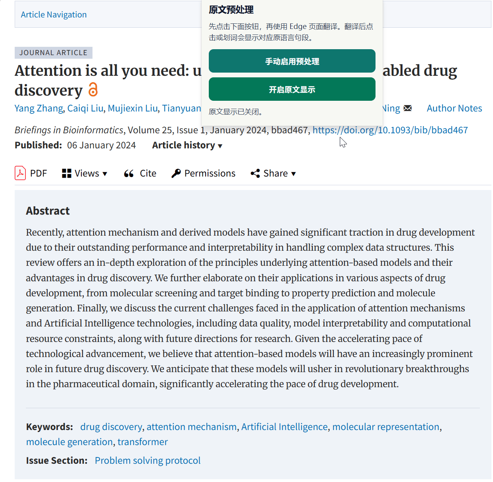
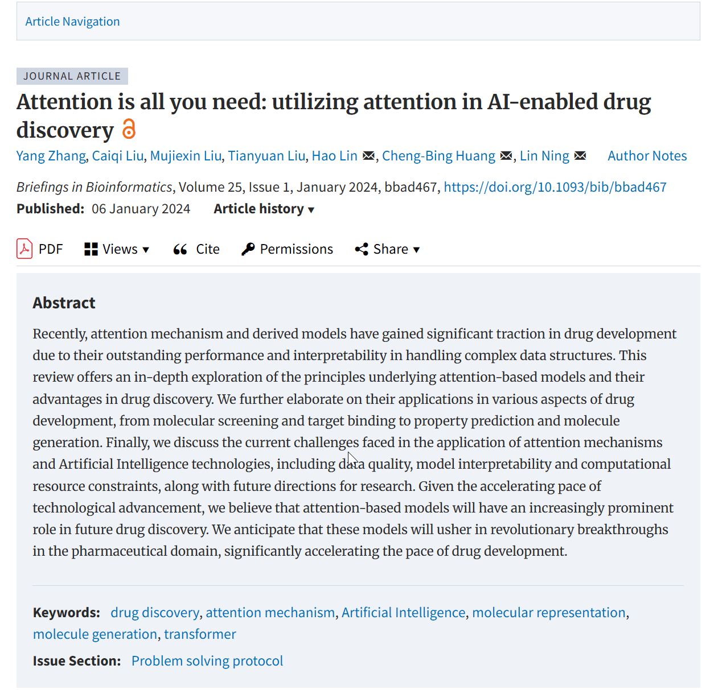

# Translate Recall — v1.5.2

Edge / Chrome Manifest V3 扩展：在浏览器翻译网页后，点击或划词查看对应原句。无需翻译 API 或密钥。

## 安装与使用

1. 打开 `edge://extensions/` 或 `chrome://extensions/`，开启开发人员模式。
2. 选择“加载解压缩的扩展”，打开项目根目录。升级后在扩展管理页重新加载扩展，并刷新目标网页。
3. 在**原语言页面**开启“原文显示”。对于懒加载页面，先展开需要阅读的内容；未翻译时后续加载的内容也会自动捕获。
4. 点击“准备原文”，**等待提示整个已加载页面处理完成**，再使用浏览器翻译。
5. 点击译文中的文字查看原句；拖选多个句子可聚合查看。浮窗支持滚动、选择和复制，按 Esc、滚动页面或调整窗口可关闭。

## v1.5.2 如何修复长页面与句子错位

- **全文捕获**：预处理同步处理整个已加载 DOM，包括屏幕外内容，不再只完成可见区域就通知用户开始翻译。
- **句子身份关联**：翻译前为文本片段插入内联 `btv-sentence` 标记，原句保存在当前页面的内存中。跨加粗、链接、公式等标签的同一句共享原文记录，保留原有元素及其事件监听器。
- **直接回查**：点击译文后，沿 DOM 找到原来的标记对象，直接返回原句；不使用译文长度比例或页面纵坐标猜测句子。
- **保护原文**：翻译后禁止重新将页面文字保存为原文；关闭再开启保留记录。复制标记属性或替换节点不会继承旧原文。
- **动态内容**：未翻译时新加入的内容自动捕获；不再主动滚动页面。
- **状态隔离**：普通业务文本更新不会被误存为译文原文；SPA 路由切换会废弃上一页面的记录。状态无法可靠判断时进入“不确定”状态，由用户明确确认原文后重新捕获。
- **可恢复交互**：弹窗显示当前页面状态，并提供“确认当前为原文并重新捕获”和“恢复页面结构”；长原文浮窗可滚动和复制，部分选区缺少记录时会明确提示。

## 边界

- “完整”指已经存在于当前页面 DOM 的可处理内容，不包括服务器尚未发送、尚未展开或虚拟列表尚未渲染的文字。翻译后才出现的内容若没有原文记录，不显示猜测结果；请恢复原文或刷新后重新预处理。
- 若翻译器或网站框架彻底删除、重建句子标记，原来的关联失效，需要恢复原文或刷新后重试。不能仅靠译文恢复从未捕获的原文。
- 标记采用自定义内联元素，已避开网站常见的 `span` 样式规则；极少数严格依赖直接文本子节点的脚本仍可能受 DOM 包装影响，可用“恢复页面结构”移除标记。
- 默认跳过代码块、表单、可编辑区域、隐藏内容及明确禁止翻译的区域。不处理 iframe 内页、Shadow DOM、Canvas 文字。
- 原文只存于当前页面内存，刷新后重新捕获；持久化的是功能开关。扩展不上传原文。

## 结构

```text
manifest.json                扩展入口和权限
src/content/content.js       防重复加载器
src/content/content.core.js  两种浏览器共用的原句标记、捕获及回查
src/popup/                   功能开关、预处理和错误提示
assets/styles/content.css   自定义句子标记与可交互原文浮窗
assets/icons/               扩展图标
assets/demo/                早期版本的使用演示
_locales/                   中文、英文文案
tests/recall.browser.test.cjs 浏览器回归测试
```

## 测试

运行需要 Node.js 和 Playwright；扩展本身无需构建或安装 Node 依赖。

```sh
npm install
npx playwright install chromium
npm test
```

也可通过 `BROWSER_EXECUTABLE` 指定已安装的 Chrome 或 Edge 可执行文件。

测试在真实浏览器中模拟文本翻译、长度变化和 DOM 包装，覆盖 2,000 个段落的长页面、跨标签与公式原句、划词端点、动态流式文本、业务文本更新、SPA 路由隔离、恢复/重新捕获、浮窗交互和弹窗消息协议。在线翻译服务的实际行为仍需手动验证：分别在 Wikipedia 长条目、GitHub 长 README 上等待预处理完成后翻译，检查顶部/中部/底部、跨格式句子及恢复原文再翻译。

## 演示（早期版本）




MIT License
